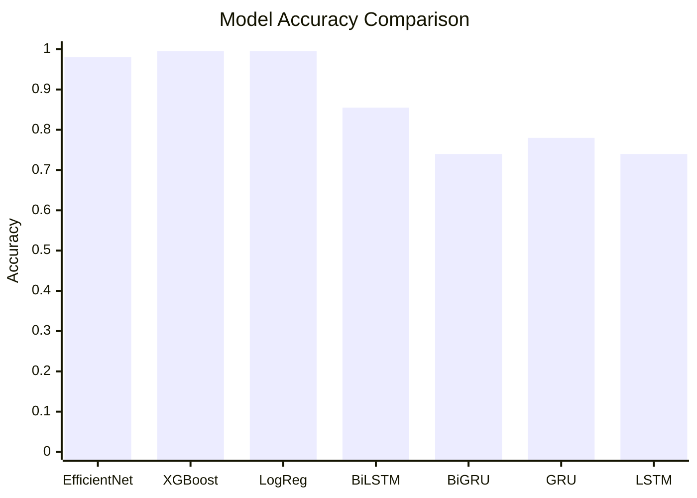
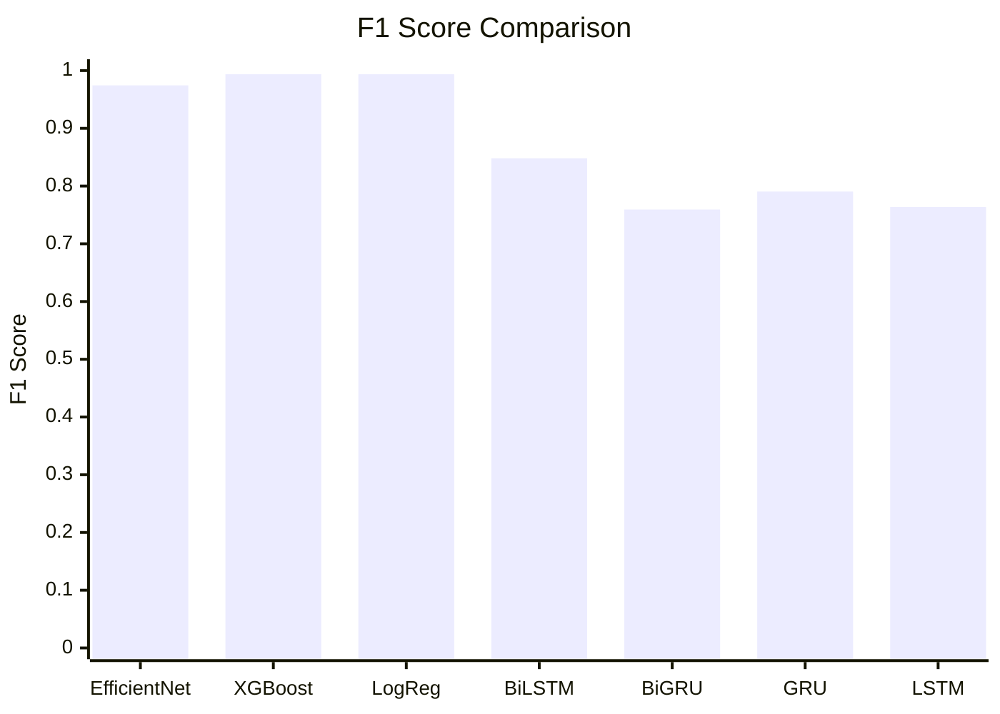
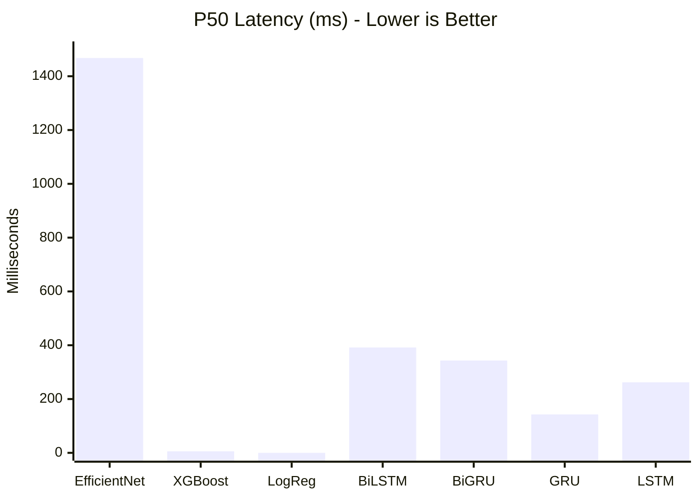
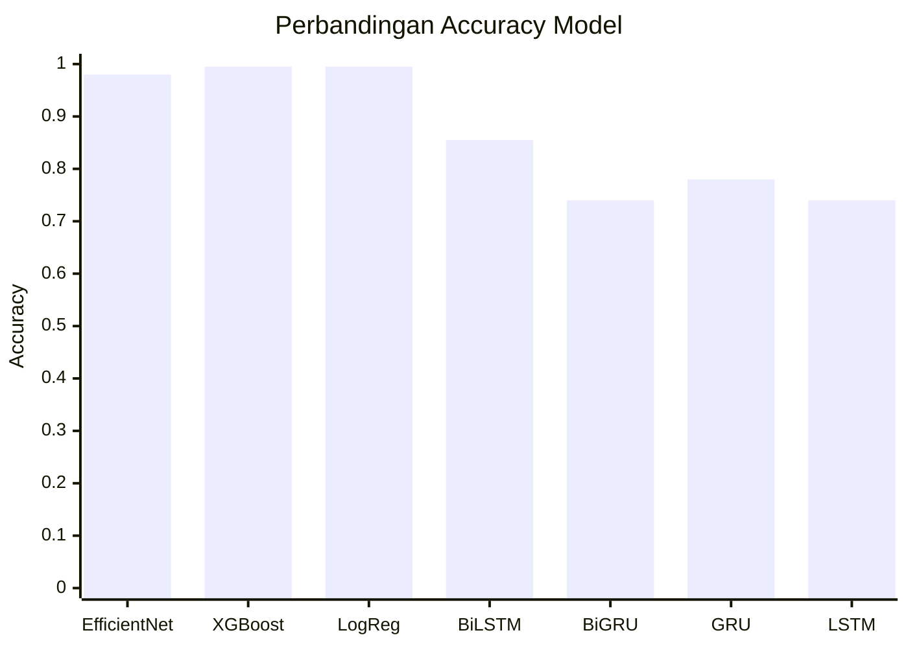
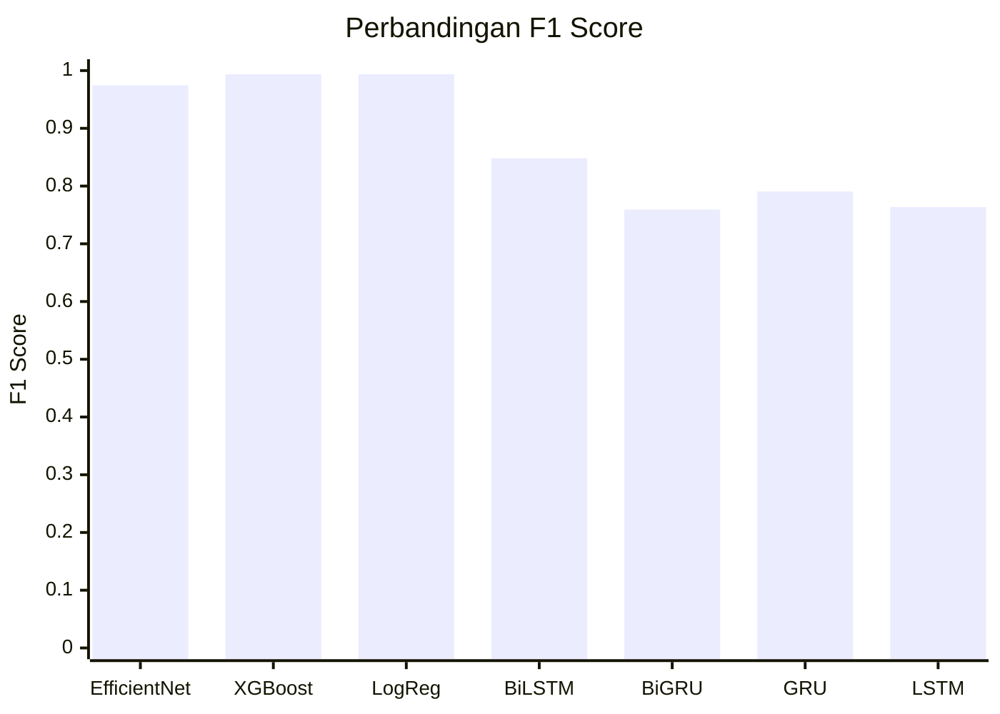
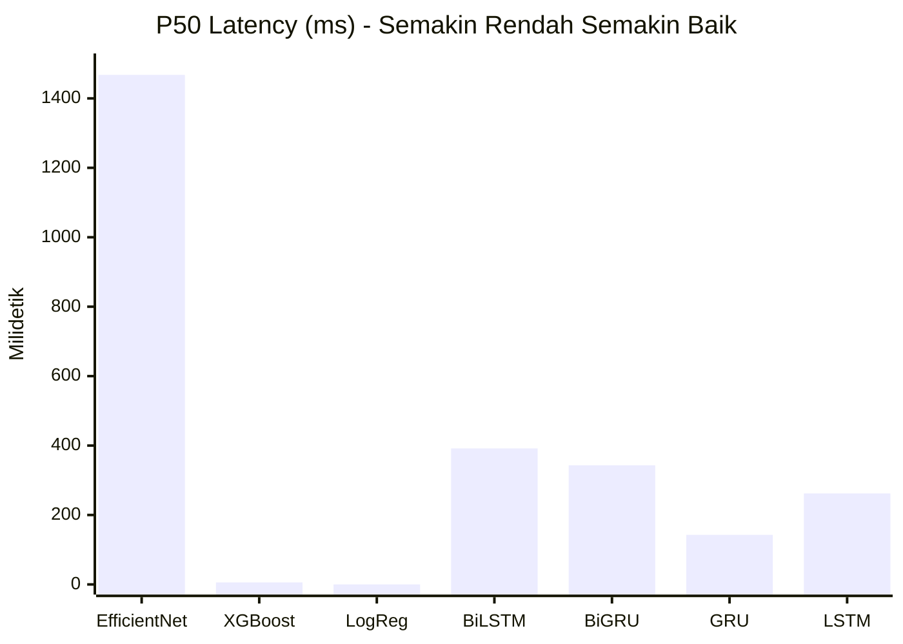

# Detectify - Deepfake Detection System

**[English](#english) | [Bahasa Indonesia](#bahasa-indonesia)**

---

<a id="english"></a>

## English

### What is Detectify?

Detectify is a deepfake detection system built to identify AI-generated content across three domains: **audio**, **images**, and **text**. It supports both English and Indonesian text analysis. Each component uses a dedicated machine learning model, and all models follow a standardized naming convention: `detectify-deepfake-<language>-<modality>-<architecture>`.

This project was built for academic purposes as part of a semester 4 coursework project.

### Project Structure

```
Detectify-ML-Model/
├── auto_run.py                           # Orchestrator script
├── scripts/
│   ├── rename_and_evaluate_models.py     # Unified evaluation for all models
│   ├── audio_pipeline_wrapper.py         # Audio model loader
│   ├── image_pipeline_wrapper.py         # Image model loader
│   ├── indo_text_pipeline_wrapper.py     # Indonesian text pipeline
│   └── train_text_indo.py               # Training script for Indo models
├── notebook/
│   ├── audio_detection/                  # Audio model notebooks and data
│   ├── image_detection/                  # Image model notebooks and data
│   ├── text_detection/                   # English text model notebooks
│   └── text_detection_indo/              # Indonesian text model notebooks
├── evaluation_results/                   # Saved evaluation outputs (JSON/CSV)
└── requirements.txt
```

---

### Models Overview

Detectify uses **8 models** organized into 4 components. The table below gives a quick summary:

| Model Name | Domain | Language | Architecture | Version |
|---|---|---|---|---|
| `detectify-deepfake-en-audio-cnn` | Audio | English | SimpleAudioCNN | 1.0.0 |
| `detectify-deepfake-en-image-efficientnet` | Image | English | EfficientNetV2 | 1.0.0 |
| `detectify-deepfake-en-text-xgboost` | Text | English | XGBoost | 1.0.0 |
| `detectify-deepfake-en-text-logreg` | Text | English | Logistic Regression | 1.0.0 |
| `detectify-deepfake-id-text-bilstm` | Text | Indonesian | BiLSTM | 1.0.0 |
| `detectify-deepfake-id-text-bigru` | Text | Indonesian | BiGRU | 1.0.0 |
| `detectify-deepfake-id-text-gru` | Text | Indonesian | GRU | 1.0.0 |
| `detectify-deepfake-id-text-lstm` | Text | Indonesian | LSTM | 1.0.0 |

---

### Component 1: Audio Detection

**Model:** `detectify-deepfake-en-audio-cnn`

This model determines whether an audio clip is real human speech or AI-generated. It uses a convolutional neural network (CNN) that processes mel-spectrograms -- visual representations of sound frequencies over time.

**How it works:**
1. The audio file is loaded and resampled to 16kHz mono
2. It gets padded or trimmed to a fixed 4-second length
3. A mel-spectrogram is computed (64 mel bands, 1024 FFT window, 256 hop)
4. The spectrogram is converted to decibel scale
5. The CNN (4 convolutional layers followed by fully connected layers) classifies it as real or fake

**Architecture:**
```
Input Audio --> Resample 16kHz --> MelSpectrogram --> CNN (Conv2d x4) --> FC --> Softmax (real/fake)
```

**Training Data:** LibriSpeech (real speech) + AI-generated samples

---

### Component 2: Image Detection

**Model:** `detectify-deepfake-en-image-efficientnet`

This model identifies whether a face image is authentic or generated/manipulated by AI tools like GANs or diffusion models. It uses EfficientNetV2-L, a large-scale convolutional network originally developed by Google for image classification.

**How it works:**
1. The input image is resized to 224x224 pixels
2. Pixel values are normalized using ImageNet statistics
3. The EfficientNetV2-L backbone extracts visual features
4. A fully connected layer (512 -> 1) produces a single output
5. A sigmoid function converts it to a probability score (>0.5 = fake)

**Architecture:**
```
Input Image --> Resize 224x224 --> Normalize --> EfficientNetV2-L --> FC(512,1) --> Sigmoid --> real/fake
```

**Training Data:** Real face images + deepfake-generated images (processed dataset with real/ and fake/ splits)

---

### Component 3: English Text Detection

**Models:** `detectify-deepfake-en-text-xgboost` and `detectify-deepfake-en-text-logreg`

These models classify whether a piece of English text was written by a human or generated by an AI tool (like ChatGPT). Two separate models are trained for comparison:

- **XGBoost** -- a gradient-boosted decision tree ensemble, known for strong tabular/feature-based performance
- **Logistic Regression** -- a simpler linear classifier that serves as a reliable baseline

**How they work:**
1. The raw text is vectorized using TF-IDF (term frequency-inverse document frequency)
2. The resulting feature vector is passed to the classifier
3. The model outputs a binary label: human (0) or AI-generated (1)

Both models are packaged as scikit-learn Pipelines, so preprocessing and prediction happen in a single `.predict()` call.

**Architecture:**
```
Input Text --> TF-IDF Vectorizer --> XGBoost / LogisticRegression --> human/AI label
```

**Training Data:** Combined dataset of human-written and AI-generated English texts (`processed_combined_ai_human.csv`)

---

### Component 4: Indonesian Text Detection

**Models:** `detectify-deepfake-id-text-bilstm`, `detectify-deepfake-id-text-bigru`, `detectify-deepfake-id-text-gru`, `detectify-deepfake-id-text-lstm`

These four models handle the same task as the English text detector, but for Bahasa Indonesia. They use recurrent neural networks (RNNs), which are well-suited for sequential data like text. Four architectures are compared:

- **BiLSTM** -- bidirectional long short-term memory, reads text in both directions
- **BiGRU** -- bidirectional gated recurrent unit, a faster variant of BiLSTM
- **GRU** -- standard gated recurrent unit, unidirectional
- **LSTM** -- standard long short-term memory, unidirectional

**How they work:**
1. Text is cleaned (regex-based) and lowercased
2. A pre-trained Doc2Vec model converts the text into a 100-dimensional vector
3. The vector is fed into the RNN (hidden size=50, 4 layers)
4. A fully connected layer maps to a single output with sigmoid activation
5. Threshold at 0.5 determines human vs AI-generated

**Architecture:**
```
Input Text (ID) --> Clean + Lowercase --> Doc2Vec (100d) --> RNN (4 layers) --> FC --> Sigmoid --> human/AI label
```

**Training Data:** Combined dataset of human-written and AI-generated Indonesian texts (`combined_ai_human_indonesia.csv`)

---

### Evaluation Results

All models are evaluated using a consistent set of 7 metrics:
- **Accuracy** -- percentage of correct predictions overall
- **Precision** -- of all samples predicted as "fake/AI", how many were actually fake/AI
- **Recall** -- of all actual fake/AI samples, how many were correctly identified
- **F1 Score** -- harmonic mean of precision and recall (balances both)
- **P50 Latency** -- median inference time per sample (50th percentile)
- **P90 Latency** -- 90th percentile inference time
- **P95 Latency** -- 95th percentile inference time

#### Classification Metrics

| Model | Accuracy | Precision | Recall | F1 Score |
|---|---|---|---|---|
| en-image-efficientnet | 0.9800 | 1.0000 | 0.9500 | 0.9744 |
| en-text-xgboost | 0.9950 | 1.0000 | 0.9877 | 0.9938 |
| en-text-logreg | 0.9950 | 1.0000 | 0.9877 | 0.9938 |
| id-text-bilstm | 0.8550 | 0.8020 | 0.9000 | 0.8482 |
| id-text-bigru | 0.7400 | 0.6508 | 0.9111 | 0.7593 |
| id-text-gru | 0.7800 | 0.6917 | 0.9222 | 0.7905 |
| id-text-lstm | 0.7400 | 0.6462 | 0.9333 | 0.7636 |

> **Note:** The audio model (`en-audio-cnn`) was not evaluated in this run because the model weights file is tracked via DVC and was not pulled locally.

#### Accuracy Comparison



#### F1 Score Comparison



#### Precision vs Recall



```mermaid
xychart-beta
    title "Precision vs Recall by Model"
    x-axis ["EfficientNet", "XGBoost", "LogReg", "BiLSTM", "BiGRU", "GRU", "LSTM"]
    y-axis "Score" 0 --> 1
    bar "Precision" [1.0, 1.0, 1.0, 0.802, 0.651, 0.692, 0.646]
    bar "Recall" [0.95, 0.988, 0.988, 0.90, 0.911, 0.922, 0.933]
```

#### Latency (Inference Speed)

| Model | P50 (ms) | P90 (ms) | P95 (ms) |
|---|---|---|---|
| en-image-efficientnet | 1467.7 | 2147.3 | 2318.9 |
| en-text-xgboost | 5.8 | 10.0 | 13.6 |
| en-text-logreg | 0.0 | 1.3 | 1.5 |
| id-text-bilstm | 391.7 | 546.7 | 611.4 |
| id-text-bigru | 343.1 | 523.4 | 599.9 |
| id-text-gru | 142.8 | 236.8 | 277.5 |
| id-text-lstm | 262.1 | 418.5 | 531.2 |



#### Key Takeaways

- **English text models (XGBoost, LogReg)** performed the best overall, with 99.5% accuracy and sub-15ms inference time. Both had perfect precision (no false positives).
- **Image detection (EfficientNetV2)** achieved 98% accuracy with perfect precision, but inference is significantly slower (~1.5 seconds per image) due to the large model size.
- **Indonesian text models** show strong recall (>90% across the board), meaning they catch most AI-generated text. However, precision is lower, indicating more false positives. BiLSTM had the best balance at 85.5% accuracy.
- **GRU** is the fastest Indonesian model (143ms P50) while still maintaining 78% accuracy, making it the most practical choice for real-time applications.

---

### How to Run

**Evaluate all models:**
```bash
python scripts/rename_and_evaluate_models.py
```

**Run via orchestrator:**
```bash
python auto_run.py
```

Results are saved to `evaluation_results/` as both CSV and JSON files.

**Requirements:**
```bash
pip install -r requirements.txt
```

---

### Tech Stack

- **Python 3.12**
- **PyTorch** -- audio CNN, image EfficientNet, Indonesian text RNNs
- **scikit-learn** -- English text pipelines, evaluation metrics
- **XGBoost** -- gradient boosting for text classification
- **timm** -- EfficientNetV2-L pretrained weights
- **torchaudio** -- audio loading and mel-spectrogram computation
- **gensim** -- Doc2Vec for Indonesian text vectorization
- **DagsHub + MLflow** -- experiment tracking and model registry

---
---

<a id="bahasa-indonesia"></a>

## Bahasa Indonesia

### Apa itu Detectify?

Detectify adalah sistem deteksi deepfake yang dibuat untuk mengidentifikasi konten buatan AI di tiga domain: **audio**, **gambar**, dan **teks**. Sistem ini mendukung analisis teks dalam Bahasa Inggris maupun Bahasa Indonesia. Setiap komponen menggunakan model machine learning khusus, dan semua model mengikuti konvensi penamaan standar: `detectify-deepfake-<bahasa>-<modalitas>-<arsitektur>`.

Proyek ini dibuat untuk keperluan akademis sebagai bagian dari tugas semester 4.

### Struktur Proyek

```
Detectify-ML-Model/
├── auto_run.py                           # Skrip orkestrator
├── scripts/
│   ├── rename_and_evaluate_models.py     # Evaluasi terpadu semua model
│   ├── audio_pipeline_wrapper.py         # Pemuat model audio
│   ├── image_pipeline_wrapper.py         # Pemuat model gambar
│   ├── indo_text_pipeline_wrapper.py     # Pipeline teks Indonesia
│   └── train_text_indo.py               # Skrip pelatihan model Indonesia
├── notebook/
│   ├── audio_detection/                  # Notebook dan data model audio
│   ├── image_detection/                  # Notebook dan data model gambar
│   ├── text_detection/                   # Notebook model teks Inggris
│   └── text_detection_indo/              # Notebook model teks Indonesia
├── evaluation_results/                   # Hasil evaluasi (JSON/CSV)
└── requirements.txt
```

---

### Ringkasan Model

Detectify menggunakan **8 model** yang disusun dalam 4 komponen:

| Nama Model | Domain | Bahasa | Arsitektur | Versi |
|---|---|---|---|---|
| `detectify-deepfake-en-audio-cnn` | Audio | Inggris | SimpleAudioCNN | 1.0.0 |
| `detectify-deepfake-en-image-efficientnet` | Gambar | Inggris | EfficientNetV2 | 1.0.0 |
| `detectify-deepfake-en-text-xgboost` | Teks | Inggris | XGBoost | 1.0.0 |
| `detectify-deepfake-en-text-logreg` | Teks | Inggris | Logistic Regression | 1.0.0 |
| `detectify-deepfake-id-text-bilstm` | Teks | Indonesia | BiLSTM | 1.0.0 |
| `detectify-deepfake-id-text-bigru` | Teks | Indonesia | BiGRU | 1.0.0 |
| `detectify-deepfake-id-text-gru` | Teks | Indonesia | GRU | 1.0.0 |
| `detectify-deepfake-id-text-lstm` | Teks | Indonesia | LSTM | 1.0.0 |

---

### Komponen 1: Deteksi Audio

**Model:** `detectify-deepfake-en-audio-cnn`

Model ini menentukan apakah klip audio merupakan suara manusia asli atau hasil generate AI. Model ini menggunakan convolutional neural network (CNN) yang memproses mel-spectrogram -- representasi visual dari frekuensi suara dari waktu ke waktu.

**Cara kerja:**
1. File audio dimuat dan di-resample ke 16kHz mono
2. Audio di-pad atau dipotong ke panjang tetap 4 detik
3. Mel-spectrogram dihitung (64 mel band, 1024 FFT window, 256 hop)
4. Spectrogram dikonversi ke skala desibel
5. CNN (4 layer convolutional diikuti layer fully connected) mengklasifikasikan sebagai asli atau palsu

**Arsitektur:**
```
Input Audio --> Resample 16kHz --> MelSpectrogram --> CNN (Conv2d x4) --> FC --> Softmax (asli/palsu)
```

**Data Pelatihan:** LibriSpeech (suara asli) + sampel buatan AI

---

### Komponen 2: Deteksi Gambar

**Model:** `detectify-deepfake-en-image-efficientnet`

Model ini mengidentifikasi apakah gambar wajah itu autentik atau dihasilkan/dimanipulasi oleh tool AI seperti GAN atau model difusi. Model ini menggunakan EfficientNetV2-L, jaringan konvolusi skala besar yang awalnya dikembangkan oleh Google untuk klasifikasi gambar.

**Cara kerja:**
1. Gambar input di-resize ke 224x224 piksel
2. Nilai piksel dinormalisasi menggunakan statistik ImageNet
3. Backbone EfficientNetV2-L mengekstrak fitur visual
4. Layer fully connected (512 -> 1) menghasilkan satu output
5. Fungsi sigmoid mengubahnya menjadi skor probabilitas (>0.5 = palsu)

**Arsitektur:**
```
Input Gambar --> Resize 224x224 --> Normalize --> EfficientNetV2-L --> FC(512,1) --> Sigmoid --> asli/palsu
```

**Data Pelatihan:** Gambar wajah asli + gambar yang dibuat deepfake (dataset terproses dengan pembagian real/ dan fake/)

---

### Komponen 3: Deteksi Teks Bahasa Inggris

**Model:** `detectify-deepfake-en-text-xgboost` dan `detectify-deepfake-en-text-logreg`

Model-model ini mengklasifikasikan apakah teks Bahasa Inggris ditulis oleh manusia atau dihasilkan oleh tool AI (seperti ChatGPT). Dua model terpisah dilatih untuk perbandingan:

- **XGBoost** -- ensemble decision tree dengan gradient boosting, unggul dalam performa berbasis fitur
- **Logistic Regression** -- classifier linear yang lebih sederhana sebagai baseline yang handal

**Cara kerja:**
1. Teks mentah divektorisasi menggunakan TF-IDF (term frequency-inverse document frequency)
2. Vektor fitur yang dihasilkan diteruskan ke classifier
3. Model menghasilkan label biner: manusia (0) atau buatan AI (1)

Kedua model dikemas sebagai scikit-learn Pipeline, sehingga preprocessing dan prediksi terjadi dalam satu panggilan `.predict()`.

**Arsitektur:**
```
Input Teks --> TF-IDF Vectorizer --> XGBoost / LogisticRegression --> label manusia/AI
```

**Data Pelatihan:** Dataset gabungan teks manusia dan teks buatan AI dalam Bahasa Inggris (`processed_combined_ai_human.csv`)

---

### Komponen 4: Deteksi Teks Bahasa Indonesia

**Model:** `detectify-deepfake-id-text-bilstm`, `detectify-deepfake-id-text-bigru`, `detectify-deepfake-id-text-gru`, `detectify-deepfake-id-text-lstm`

Empat model ini menangani tugas yang sama dengan detektor teks Inggris, tetapi untuk Bahasa Indonesia. Model-model ini menggunakan recurrent neural network (RNN), yang cocok untuk data sekuensial seperti teks. Empat arsitektur dibandingkan:

- **BiLSTM** -- bidirectional long short-term memory, membaca teks dari dua arah
- **BiGRU** -- bidirectional gated recurrent unit, varian BiLSTM yang lebih cepat
- **GRU** -- gated recurrent unit standar, satu arah
- **LSTM** -- long short-term memory standar, satu arah

**Cara kerja:**
1. Teks dibersihkan (berbasis regex) dan diubah ke huruf kecil
2. Model Doc2Vec yang telah dilatih mengubah teks menjadi vektor 100 dimensi
3. Vektor dimasukkan ke RNN (hidden size=50, 4 layer)
4. Layer fully connected memetakan ke satu output dengan aktivasi sigmoid
5. Threshold di 0.5 menentukan manusia vs buatan AI

**Arsitektur:**
```
Input Teks (ID) --> Bersihkan + Huruf Kecil --> Doc2Vec (100d) --> RNN (4 layer) --> FC --> Sigmoid --> label manusia/AI
```

**Data Pelatihan:** Dataset gabungan teks manusia dan teks buatan AI dalam Bahasa Indonesia (`combined_ai_human_indonesia.csv`)

---

### Hasil Evaluasi

Semua model dievaluasi menggunakan 7 metrik yang konsisten:
- **Accuracy** -- persentase prediksi benar secara keseluruhan
- **Precision** -- dari semua sampel yang diprediksi "palsu/AI", berapa yang benar-benar palsu/AI
- **Recall** -- dari semua sampel palsu/AI yang sebenarnya, berapa yang berhasil teridentifikasi
- **F1 Score** -- rata-rata harmonis dari precision dan recall (menyeimbangkan keduanya)
- **P50 Latency** -- waktu inferensi median per sampel (persentil ke-50)
- **P90 Latency** -- waktu inferensi persentil ke-90
- **P95 Latency** -- waktu inferensi persentil ke-95

#### Metrik Klasifikasi

| Model | Accuracy | Precision | Recall | F1 Score |
|---|---|---|---|---|
| en-image-efficientnet | 0.9800 | 1.0000 | 0.9500 | 0.9744 |
| en-text-xgboost | 0.9950 | 1.0000 | 0.9877 | 0.9938 |
| en-text-logreg | 0.9950 | 1.0000 | 0.9877 | 0.9938 |
| id-text-bilstm | 0.8550 | 0.8020 | 0.9000 | 0.8482 |
| id-text-bigru | 0.7400 | 0.6508 | 0.9111 | 0.7593 |
| id-text-gru | 0.7800 | 0.6917 | 0.9222 | 0.7905 |
| id-text-lstm | 0.7400 | 0.6462 | 0.9333 | 0.7636 |

> **Catatan:** Model audio (`en-audio-cnn`) tidak dievaluasi pada run ini karena file bobot model dilacak melalui DVC dan belum di-pull secara lokal.

#### Perbandingan Accuracy



#### Perbandingan F1 Score



#### Precision vs Recall


#### Latensi (Kecepatan Inferensi)

| Model | P50 (ms) | P90 (ms) | P95 (ms) |
|---|---|---|---|
| en-image-efficientnet | 1467.7 | 2147.3 | 2318.9 |
| en-text-xgboost | 5.8 | 10.0 | 13.6 |
| en-text-logreg | 0.0 | 1.3 | 1.5 |
| id-text-bilstm | 391.7 | 546.7 | 611.4 |
| id-text-bigru | 343.1 | 523.4 | 599.9 |
| id-text-gru | 142.8 | 236.8 | 277.5 |
| id-text-lstm | 262.1 | 418.5 | 531.2 |



#### Temuan Utama

- **Model teks Inggris (XGBoost, LogReg)** memberikan performa terbaik secara keseluruhan, dengan accuracy 99.5% dan waktu inferensi di bawah 15ms. Keduanya memiliki precision sempurna (tanpa false positive).
- **Deteksi gambar (EfficientNetV2)** mencapai accuracy 98% dengan precision sempurna, tetapi inferensi jauh lebih lambat (~1.5 detik per gambar) karena ukuran model yang besar.
- **Model teks Indonesia** menunjukkan recall yang kuat (>90% di semua model), artinya model berhasil menangkap sebagian besar teks buatan AI. Namun precision lebih rendah, menandakan lebih banyak false positive. BiLSTM memiliki keseimbangan terbaik di accuracy 85.5%.
- **GRU** adalah model Indonesia tercepat (143ms P50) dengan tetap mempertahankan accuracy 78%, menjadikannya pilihan paling praktis untuk aplikasi real-time.

---

### Cara Menjalankan

**Evaluasi semua model:**
```bash
python scripts/rename_and_evaluate_models.py
```

**Jalankan via orkestrator:**
```bash
python auto_run.py
```

Hasil disimpan ke `evaluation_results/` dalam format CSV dan JSON.

**Kebutuhan:**
```bash
pip install -r requirements.txt
```

---

### Tech Stack

- **Python 3.12**
- **PyTorch** -- audio CNN, image EfficientNet, RNN teks Indonesia
- **scikit-learn** -- pipeline teks Inggris, metrik evaluasi
- **XGBoost** -- gradient boosting untuk klasifikasi teks
- **timm** -- bobot pretrained EfficientNetV2-L
- **torchaudio** -- pemuatan audio dan komputasi mel-spectrogram
- **gensim** -- Doc2Vec untuk vektorisasi teks Indonesia
- **DagsHub + MLflow** -- pelacakan eksperimen dan registri model

---

### License

This project is for academic use only.

Proyek ini hanya untuk keperluan akademis.
